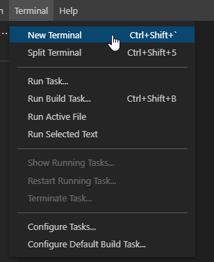
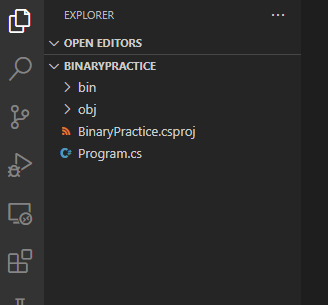

# Binary Numbers in C#

In this activity, you will use C#'s `Convert` utility to explore how computers store 32-bit integers. By the end of this activity you should understand:

1. How to convert `int` values between binary, decimal, and hexadecimal representations.
2. Understand how positive and negative integers are represented in binary.
3. Understand the difference between Overflow and Underflow errors.

When you're done with this project, you should upload your completed `Program.cs` file to Google Classroom.

## Create a new C# Project

Let's start by creating a new C# project.

1. Create a new folder on your computer for your C# project.
2. Next, open the folder using Visual Studio Code
3. Open a new Terminal
   * From the top menu select Terminal > New Terminal

4. In the terminal, run the command `dotnet new console`

If all went well, you should now see several project files in your package explorer.

5. Open the `Program.cs` file. This file contains a simple "Hello World" program you can run.

6. Run the project by executing `dotnet run` in your terminal.

## Converting integers to Binary and Hex

An integer is a whole number: 0, 5, 9, -72. An integer cannot store a number that is requires a fractional representation. For example: 2.5, -3.999, and 72.7 are not integers.

Previously, you created integers in C# using the `int` variable type. Let's go ahead and make an `int` variable called `x` now and assign it the value `42`.

1. Update the main method your Program.cs file to create an `int x`, assign it the value `42` and then write that value to the terminal.

2. Next, run your program in the terminal. If all goes well, you will see the number `42` displayed.

The `int` data type in C# uses 32-bits to store data. C# provides a `Convert` utility that can show the binary representation of a number. Let's test this out now:

3. Update your code to convert `x` to a `string` representing the binary version of `x`;

4. Run your program to see the binary version of `x`.

Notice that the binary number truncates the leading 0s. `x` is in fact 32-bits long inside of the computer.

The `Convert` utility can also convert the number to a hexadecimal number.

5. Update your code to convert `x` to a `string` representing the hexadecimal version of `x`.

6. Run your program to see the hex version of `x`.

## Negative Integers

The `int` data type in C# uses 32-bits to represent the number. An `int` can be positive or negative. To track this, we use the highest order bit (32nd bit) to represent if the number is positive (0) or negative (1).

We can test this out by creating a negative int and converting it to binary:

1. Update your code to have an `int y` and assign it the value -1.
2. Convert `y` to binary.
3. Write the result to the console.

4. Run your program to see the binary version of `y`.

If you count the number of digits, you will find that there are 32-bits in this number.

We represent negative numbers this way to make math work identical to positive numbers. If you decrease `y` by one, you will get `-2`. Which, in binary, simply reduces the right most bit by 1.

5. Add a value `z` to your program and assign it to be `y -1`.
6. Convert `z` to binary.
7. Write the result to the console.

8. Run your program to see the binary version of `z`

Notice, the right most bit is 0. This is because the number was decreased by 1.

## Overflow and Underflow Errors

Because `int` values use 32-bits of data, we have a finite number of values we can represent. In this case, 2^32 possibilities. 2^31 of them are positive and the other 2^31 are negative.

The maximum positive integer is `2^31 - 1` and the minimum negative integer is `-2^31`. C# provides a quick constant for accessing these values.

1. Update your code to print `int.MaxValue` and `int.MinValue`.

2. Run your program to see the result.

3. Update your code to convert the max and min values to binary and print write them to the console.

4. Run your program to see the result.

If you were to count the number of digits, you would find that `int.MaxValue` contains 31 digits (the 32nd bit is a leading zero that is not shown). Similarly, `int.MinValue` contains 32 digits.

Notice, that `int.MinValue` is equivalent to adding 1 to `int.MaxValue`. Let's verify this with code:

5. Update your code to have an `int` called `max` that stores `int.MaxValue`.
6. Add a second variable `max_plus_1` that stores `max + 1`
7. Write `max_plus_1` to the console.
8. Convert `max_plus_1` to a binary value.
9. Write the result to the console.

9. Run your program to see the result.

Notice, the result is a negative number. In fact, the negative number is the minimum integer value.

When we add two integers together and the resulting value is too large to be represented by the number of available bits, we call this an **Overflow Error**.

Similarly, when we subtract two integers and the difference is too small to be represented by the number of available bits, we call this an **Underflow Error**.

## Submit your Program.cs File

Now that you have completed this activity, you should upload your completed `Program.cs` file to Google Classroom and submit the assignment to let me know you've completed this activity.